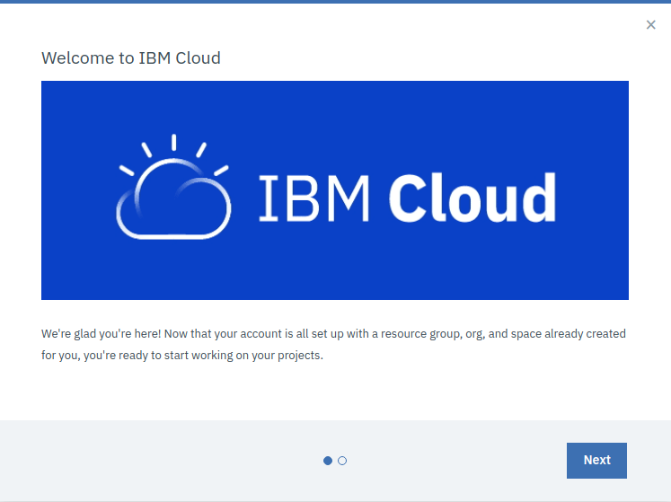
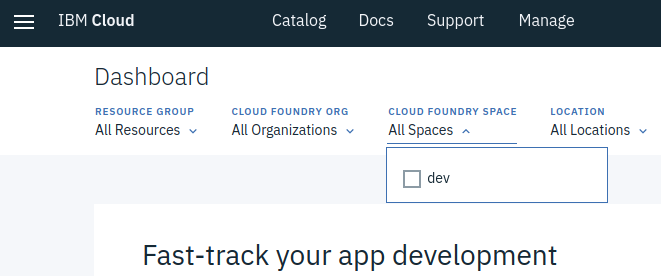

# Get Started using Google Cloud Shell

[Codelab Feedback](https://github.com/loopstore/loopstore-tutorial-v4/issues)


## Introduction


In this HOW-TO section we'll be creating a free tier IBM Cloud account and setting up Cloud Foundry app instance for deploying our LoopStore.

We'll install and configure the IBM Cloud CLI for deploying our app..

We'll also set up a Cloudant database service and update the code so we can use it to persist data for our  [Models](https://loopback.io/doc/en/lb4/Model.html). 

```<code snippet>```

<walkthrough-editor-open-file  filePath="test.md" text="Open test.md">
</walkthrough-editor-open-file>


## Why use IBM Cloud?


LoopBack apps can be hosted in any  [Node.js](https://nodejs.org/) environment and connect to a wide variety of data  sources. 

[IBM Cloud](https://www.ibm.com/cloud/) is a convenient option for getting our LoopStore up and running on the web. It offers full-stack cloud platform with over 170 products and services. It also offers a useful free tier to give developers a chance to explore, with no need to enter credit card details.

All you really need is an email address to confirm your registration, a first and last name and your region to create an IBM id.

That'll get us 256MB of memory on IBM's  [Cloud Foundry](https://www.cloudfoundry.org/the-foundry/ibm-cloud-foundry/) platform, where we'll set up a vanilla  [Node.js](https://nodejs.org/) instance for deploying our LoopStore app to the cloud.

As a big bonus, our IBM id gives us access to the  [Cloudant](https://www.ibm.com/cloud/cloudant) database service. We can connect to all sorts of backend data services through LoopBack's  [DataSources](https://loopback.io/doc/en/lb4/DataSources.html). Cloudant is a distributed, non-relational document database (a bit like  [MongoDB](https://www.mongodb.com/)), which suits storing data for our LoopBack  [Models](https://loopback.io/doc/en/lb4/Model.html) well. 


## Sign up for IBM Cloud and login to the console


Fill in your email, name, region  [IBM Cloud signup page](https://console.bluemix.net/registration/) and once you've responded to the confirmation email and logged in you should end up with a lovely welcome message.



**Welcome to IBM Cloud!**

Note that the welcome message tells you that your account is all set up with a:

* **resource group**;
* **org**, and;
* **space**

You'll need to know some of these to configure the CLI. 

Once you've dismissed this message, you'll find yourself on your  [IBM Cloud Dashboard](https://console.bluemix.net/dashboard/apps).

Wondering why the console (and soon our LoopStore) are hosted at bluemix.net? - IBM Cloud  [changed its name from Bluemix in 2017](https://www.ibm.com/blogs/bluemix/2017/10/bluemix-is-now-ibm-cloud/)

You can see from the dropdowns at the top of the Dashboard that your **organisation** has been created using your **email address**, and there is a single **space **called **dev.**

**These are the default settings that will be used when you create your Cloud Foundry app you will need them to configure the CLI.**




Hit the hamburger top-left and you'll meet the side menu that allows you to find your way around the vast IBM Cloud platform.


## Configure the DataSource in data.db to use loopback-connector-cloudant


## Deploy LoopStore to the cloud!


## Test your deployment


## Setting up a local Cloudant database


## Considerations for production deployment


